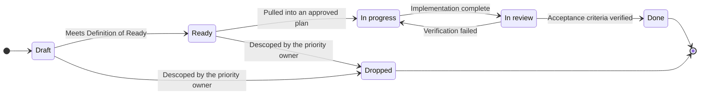
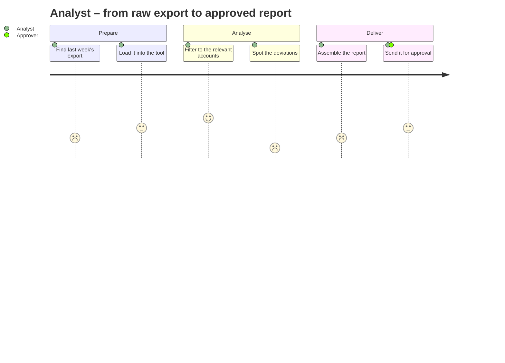
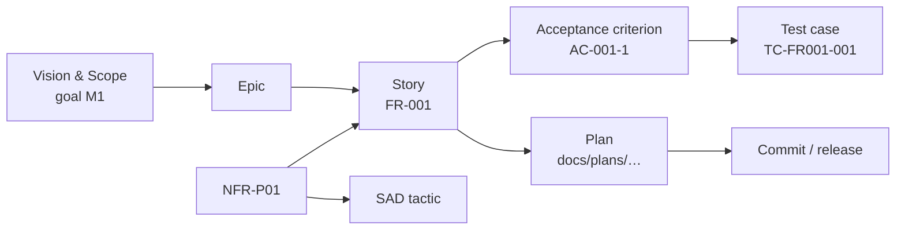

# Requirements Documentation

## [Product name]

| | |
| --- | --- |
| **Version** | 0.1 |
| **Status** | Draft / Active backlog |
| **Date** | YYYY-MM-DD |
| **Author** | [Name] |
| **Related to** | Vision & Scope v[X.X] |

### Version history

| Version | Date | Change | Author |
| --- | --- | --- | --- |
| 0.1 | YYYY-MM-DD | Initial version | [Name] |

---

## 1. Non-functional requirements (NFRs)

> Define NFRs **before** specifying functional requirements in detail; they shape the architecture.

### Performance

| ID | Requirement | Metric | Target | MoSCoW |
| --- | --- | --- | --- | --- |
| NFR-P01 | Response time for [main function] | 95th percentile response time | < [X] ms | M |
| NFR-P02 | The system must handle [X] concurrent users | Concurrent users under load test | [X] | S |

### Availability

| ID | Requirement | Metric | Target | MoSCoW |
| --- | --- | --- | --- | --- |
| NFR-A01 | Planned uptime | Uptime per month | [X]% | M |
| NFR-A02 | Maximum recovery time after failure | RTO | < [X] min | S |

### Scalability

| ID | Requirement | MoSCoW |
| --- | --- | --- |
| NFR-S01 | The system must support [X]% data growth over [Y] years without redesign | C |

### Maintainability

| ID | Requirement | MoSCoW |
| --- | --- | --- |
| NFR-M01 | All business logic must be unit-testable without external infrastructure | M |
| NFR-M02 | Application logs must be structured JSON with at least INFO level in production | S |

### Security (baseline)

| ID | Requirement | MoSCoW |
| --- | --- | --- |
| NFR-SEC01 | All communication must use TLS 1.2 or higher | M |
| NFR-SEC02 | Authenticated endpoints must require a valid session/token | M |

### Portability / Environment requirements

| ID | Requirement | MoSCoW |
| --- | --- | --- |
| NFR-PT01 | [Browser compatibility / OS requirements / etc.] | [M/S/C] |

---

## 2. Functional requirements – User Stories

A user story is the unit of product work in this project. It names a role, a capability, and a
reason, and it is finished only when its acceptance criteria are verified. Stories are the anchor
for planning, implementation, and testing: a plan declares which stories it delivers, and a test
case cites the acceptance criterion it proves.

### 2.1 Roles

Every story names a role from this table. Roles are derived from Vision & Scope §3; keep the two
lists consistent. A story whose role is not listed here signals either a missing role or a story
that belongs to a different product.

| ID | Role | Description | Primary/Secondary |
| --- | --- | --- | --- |
| R1 | [Primary user] | The person who actively uses the system | Primary |
| R2 | [Affected party] | The person affected by the system's output | Secondary |
| R3 | [Technical operator] | The person who operates and maintains the system | Secondary |

> Write the role, never a job title the reader must decode, and never “the user” when the product
> has more than one kind of user. `As R3 – operator` and `As R1 – analyst` lead to different
> designs; `As a user` leads to neither.

### 2.2 Story quality bar

A story is well-formed when it satisfies INVEST:

| Property | Test |
| --- | --- |
| **Independent** | It can be built without waiting for another unfinished story |
| **Negotiable** | It states the need and the outcome, not the implementation |
| **Valuable** | The “so that” clause names value for the role, not for the codebase |
| **Estimable** | The team can size it without first building it |
| **Small** | It fits inside one plan and one review |
| **Testable** | Each acceptance criterion can be proven by an observation |

**When a story is too large, split it by behavior, not by layer.** “Build the database table”,
“build the API”, and “build the UI” are three fragments of one story that deliver nothing until all
three land. Split instead along:

- workflow steps — separate the happy path from the exceptional path;
- rules — one story per business rule or validation family;
- data variants — the simplest input type first, richer ones later;
- interfaces — the primary surface first, secondary surfaces later;
- effort — the manual or hard-coded version first, the automated version later.

### 2.3 Story lifecycle



A **Dropped** story is not deleted. Set its status, record the reason, and leave the ID retired so
that historical plans, commits, and test cases keep resolving.

**Definition of Ready** — a story may not enter a plan until all of these hold:

- [ ] The role is one of the roles in §2.1.
- [ ] The value clause states an outcome for that role, not a technical task.
- [ ] Acceptance criteria are written and each one is observable.
- [ ] Dependencies on other stories are either resolved or explicitly noted.
- [ ] Any NFR that constrains the story is referenced by ID.
- [ ] The priority owner has set a MoSCoW priority.
- [ ] The story is small enough to fit one plan; otherwise it is split first.

### 2.4 Story map

The story map shows the product as the user experiences it. The **backbone** is the sequence of
steps a role takes to reach an outcome; each column collects the stories that support that step.
Reading a row gives a release; reading a column gives a capability.

Draw the backbone with Mermaid or an equivalent tool. Replace the example below with the project's
own journey.



> Scores are 1–5 and record how the step feels **today**, not after the product ships. Low scores
> are where the product earns its value; they should attract the Must-have stories.

| Release slice | [Backbone step 1] | [Backbone step 2] | [Backbone step 3] | [Backbone step 4] |
| --- | --- | --- | --- | --- |
| **MVP** (Must) | FR-001 | FR-010 | FR-020 | — |
| **Next** (Should) | FR-002 | FR-011 | — | FR-030 |
| **Later** (Could) | — | FR-012 | FR-021 | — |

A column with no Must-have story is a gap in the walking skeleton: the user cannot complete the
journey. A column crowded with Must-have stories usually hides a step that should be split.

### 2.5 Epic overview

| Epic | Outcome for the role | Primary role | Stories | M/S/C/W | Status |
| --- | --- | --- | --- | --- | --- |
| [Epic name] | [What the role can do once the epic is complete] | R1 | FR-001…FR-002 | 2/0/0/0 | In progress |
| [Next epic name] | [Outcome] | R2 | FR-010…FR-012 | 1/1/1/0 | Draft |

---

### 2.6 Stories

> **Format:**
> `As a [role], I want [capability] so that [business value]`
> Each story has a unique ID, a MoSCoW priority, a status, and acceptance criteria.
>
> **Splitting this document:** when the backlog passes roughly 20 active stories, or more than one
> person maintains it, move §2.6 to `docs/02-user-stories.md` and leave a pointer here. Sections
> 2.1–2.5 and 3–5 stay in this document; they are the stable contract, while §2.6 is the churning
> part. Very large backlogs may shard further into one file per epic under `docs/stories/`.

---

#### Epic: [Epic name – e.g. “User management”]

---

##### FR-001 · [Short story title]

| | |
| --- | --- |
| **Epic** | [Epic name] |
| **Role** | R1 – [Role name] |
| **Priority** | M / S / C / W |
| **Status** | Draft / Ready / In progress / In review / Done / Dropped |
| **Size** | XS / S / M / L *(L must be split before it is Ready)* |
| **Related NFR** | NFR-[ID] *(if applicable)* |
| **Depends on** | FR-[ID] *(if applicable)* |

**Story:**
As R1 – [role]
I want [capability]
so that [business value].

**Acceptance criteria:**

```text
AC-001-1:
  Given [precondition]
  When [action/event]
  Then [expected outcome]

AC-001-2:
  Given [precondition]
  When [action/event]
  Then [expected outcome]
```

**Out of scope for this story:** *(optional; prevents the story from growing during implementation)*
[What a reader might reasonably assume is included but is not, and where it is handled instead]

**Technical notes:** *(optional implementation notes, not requirements)*
[Technical considerations relevant to the story]

---

##### FR-002 · [Short story title]

| | |
| --- | --- |
| **Epic** | [Epic name] |
| **Role** | R1 – [Role name] |
| **Priority** | M / S / C / W |
| **Status** | Draft / Ready / In progress / In review / Done / Dropped |
| **Size** | XS / S / M / L |

**Story:**
As R1 – [role]
I want [capability]
so that [business value].

**Acceptance criteria:**

```text
AC-002-1:
  Given [precondition]
  When [action/event]
  Then [expected outcome]
```

---

#### Epic: [Next epic name]

---

##### FR-010 · [Short story title]

| | |
| --- | --- |
| **Epic** | [Next epic name] |
| **Role** | R2 – [Role name] |
| **Priority** | M / S / C / W |
| **Status** | Draft / Ready / In progress / In review / Done / Dropped |
| **Size** | XS / S / M / L |

**Story:**
As R2 – [role]
I want [capability]
so that [business value].

**Acceptance criteria:**

```text
AC-010-1:
  Given [precondition]
  When [action/event]
  Then [expected outcome]
```

---

## 3. Use Cases (for complex flows)

> Use this when a flow involves multiple actors or systems, or has many failure scenarios.
> Skip this section when user stories cover the need.

---

### UC-001 · [Use case title]

| Field | Value |
| --- | --- |
| **ID** | UC-001 |
| **Primary actor** | [User / System] |
| **Preconditions** | [What must be true before the use case starts] |
| **Postconditions (success)** | [System state after successful execution] |
| **Postconditions (failure)** | [System state if the use case is aborted] |
| **Related stories** | FR-[ID], FR-[ID] |

**Main flow:**

1. [Actor does something]
2. [System responds]
3. [Actor takes the next step]
4. [System finishes with...]

**Alternative flows:**

*Alt 3a – [Description of failure case]:*

1. [What happens instead]
2. [How is it handled?]
3. The use case [resumes at step X / ends]

---

## 4. Priority overview (MoSCoW)

> Priorities are decisions, not technical facts. Record who owns them.

**Priority owner:** [Name / role]

| Priority | Number of stories | Story IDs |
| --- | --- | --- |
| **Must have** | [X] | FR-001, FR-002, ... |
| **Should have** | [X] | FR-010, ... |
| **Could have** | [X] | FR-020, ... |
| **Won't have (now)** | [X] | FR-030, ... |

---

## 5. Requirements traceability

Every requirement is traceable from the goal that motivated it to the evidence that it works:



The plan is transient and is deleted when its change merges; the durable record is this table plus
the release history in Change Management. Update the status here at the plan's closeout gate, not
while the work is still in progress.

| Requirement ID | Related component (SAD) | Test case | Status |
| --- | --- | --- | --- |
| FR-001 | [Component in SAD] | TC-FR001-001 | Not started / Implemented / Tested |
| NFR-P01 | [Component in SAD] | TC-NFR-P01 | |

---

*Next step: Start the SAD draft based on these requirements, with particular focus on the NFRs.*

*Clarity Framework v3.6.0 – Requirements Documentation*
