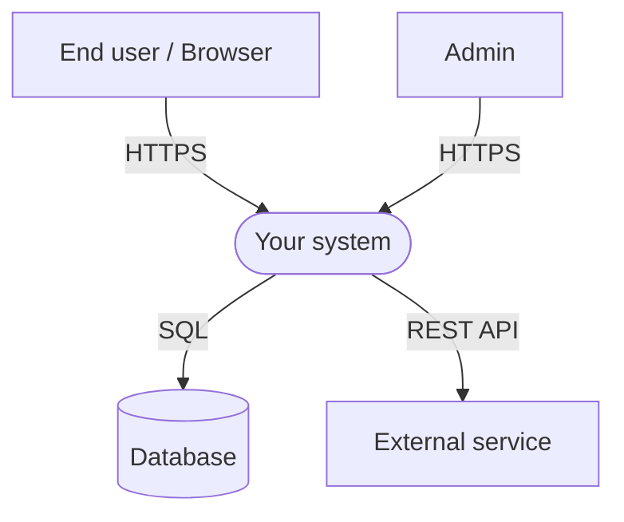
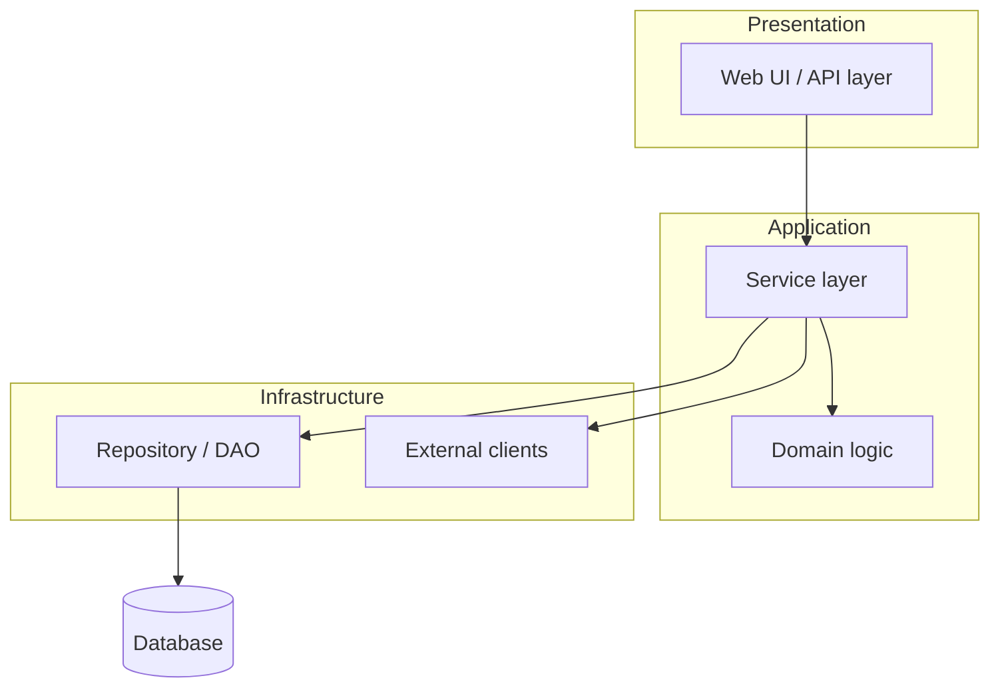
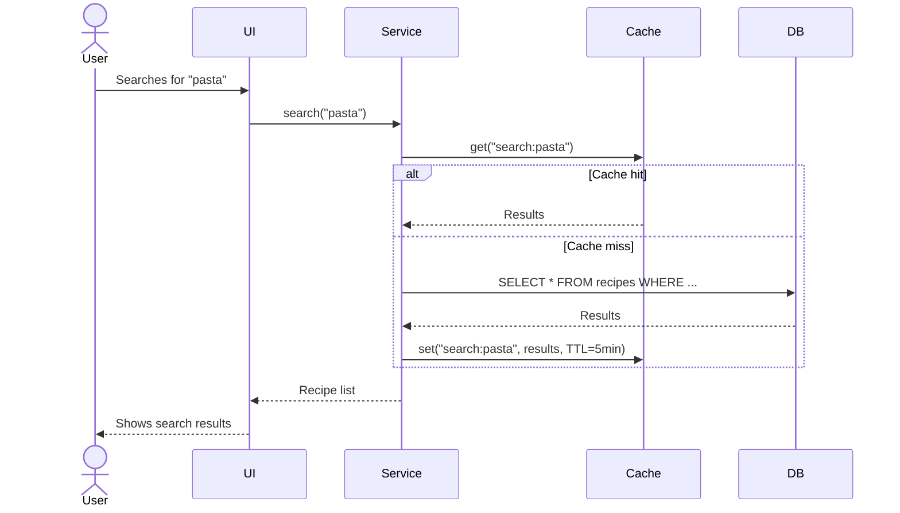

# System Architecture Document (SAD)

## [Product name]

| | |
| --- | --- |
| **Version** | 0.1 |
| **Status** | Draft / Under review / Approved |
| **Date** | YYYY-MM-DD |
| **Author** | [Name] |
| **Related to** | Requirements Documentation v[X.X] |

### Version history

| Version | Date | Change | Author |
| --- | --- | --- | --- |
| 0.1 | YYYY-MM-DD | Initial version | [Name] |

---

## 1. Architecture overview

> *Half to one page summarizing the system's overall design. It should be readable on its own.*

**Architectural pattern:**
[Describe the chosen pattern, e.g. Layered Architecture, Hexagonal Architecture, Event-Driven,
Microservices, or Monolith.]

**Primary technologies:**
[List the most important technology choices and one reason for each.]

**Most important quality attributes, in priority order:**

1. [e.g. Maintainability – the codebase must remain easy to change]
2. [e.g. Correctness – financial data must never be inaccurate]
3. [e.g. Performance]

**Architectural constraints:**
[Requirements or decisions that limit the available choices, e.g. “must run on-premises” or
“existing database system”.]

---

## 2. Context view

> Show the system as a black box and its relationships with external actors and systems. Draw with
> Mermaid, draw.io, or an equivalent tool. Replace the example below with the project's diagram.

**External relationships:**

| Actor / System | Relationship | Protocol / Format | Direction |
| --- | --- | --- | --- |
| [End user] | Primary user of the system | HTTPS / Browser | → System |
| [External API] | [Describe the purpose] | REST / JSON | System → |
| [Database] | Primary data persistence | SQL / JDBC | System → |

---

## 3. Component view

> Show the system's internal structure: modules, layers, services, and dependencies.

**Component descriptions:**

| Component | Responsibility | Technology |
| --- | --- | --- |
| [Web UI / API layer] | Receives HTTP requests, validates input, returns responses | [e.g. Spring MVC / React] |
| [Service layer] | Orchestrates business flows and transactions | [e.g. Spring Service] |
| [Domain logic] | Core business rules and domain objects | [e.g. Java POJO / domain model] |
| [Repository / DAO] | Database abstraction and CRUD operations | [e.g. Spring Data JPA] |
| [External clients] | Integrations with external APIs | [e.g. Feign / RestTemplate] |

---

## 4. Data-flow view

> Describe the data flow for the two or three most important use cases. Focus on the core scenarios.

### Data flow: [Flow name – e.g. “User searches for recipes”]

---

## 5. Technology choices

> Document what was chosen, why it was chosen, and what was considered but rejected.

| Component | Chosen technology | Rationale | Alternatives considered |
| --- | --- | --- | --- |
| Backend framework | [e.g. Spring Boot] | [Team skills, ecosystem, DI] | [e.g. Micronaut, Quarkus] |
| Frontend | [e.g. React + Tailwind] | [Component-based, fast styling] | [e.g. Vue, vanilla HTML] |
| Database | [e.g. PostgreSQL] | [Relational data, ACID, open source] | [e.g. MySQL, MongoDB] |
| Authentication | [e.g. JWT + OAuth2] | [Stateless, standardized] | [e.g. session-based] |
| Build / deployment | [e.g. Maven + Docker] | [Reproducible build, portability] | [e.g. Gradle, bare metal] |
| CI/CD | [e.g. GitHub Actions] | [Integrated with repository] | [e.g. Jenkins, GitLab CI] |

---

## 6. Architecture decisions (ADR)

> This document is where ADRs are written — the decision lives next to the architecture it explains.
> Document every significant architectural decision here. Mark superseded ADRs with
> `Status: Superseded`; never delete them, and add a row to `docs/08-change-management.md` §2 so the
> supersession stays findable when this section is rewritten.

### ADR-001 · [Decision title]

| Field | Value |
| --- | --- |
| **Status** | Proposed / Under review / Approved / Superseded |
| **Date** | YYYY-MM-DD |
| **Decision owner** | [Name] |

**Context:**
[Describe the situation and problem that led to the decision. What needed to be decided?]

**Decision:**
[Describe the decision concretely and without ambiguity.]

**Rationale:**
[Why was this decision made? Which factors mattered most?]

**Consequences:**

| + Benefits | - Drawbacks |
| --- | --- |
| [Benefit 1] | [Drawback 1] |
| [Benefit 2] | [Drawback 2] |

**Alternatives considered:**

- **[Alternative A]:** [Why it was rejected]
- **[Alternative B]:** [Why it was rejected]

### ADR-002 · [Next decision title]

| Field | Value |
| --- | --- |
| **Status** | Approved |
| **Date** | YYYY-MM-DD |
| **Decision owner** | [Name] |

**Context:**
[…]

**Decision:**
[…]

**Consequences:**

| + Benefits | - Drawbacks |
| --- | --- |
| | |

---

## 7. Quality attributes and architectural tactics

> Connect NFRs from Requirements Documentation to concrete architectural solutions.

| NFR ID | Requirement | Architectural solution / tactic |
| --- | --- | --- |
| NFR-P01 | Response time < [X] ms | [e.g. Redis caching, database indexing] |
| NFR-A01 | Uptime [X]% | [e.g. health endpoint, automatic restart] |
| NFR-M01 | Testable business logic | [e.g. hexagonal architecture, dependency injection] |
| NFR-SEC01 | TLS 1.2+ | [e.g. reverse proxy terminates TLS] |

---

## 8. Technical debt and known gaps

> Document deliberate compromises. Visible technical debt is manageable.

| ID | Description | Reason | Planned action |
| --- | --- | --- | --- |
| TD-001 | [Compromise or gap] | [Why was it made?] | [Sprint/version for resolution] |

---

*Next step: Specify the Data Model & API Contract based on the component and data-flow views in this document.*

*Clarity Framework v3.3.0 – System Architecture Document*
