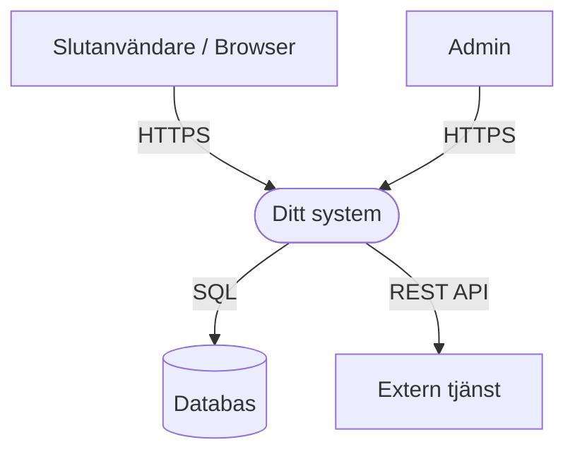
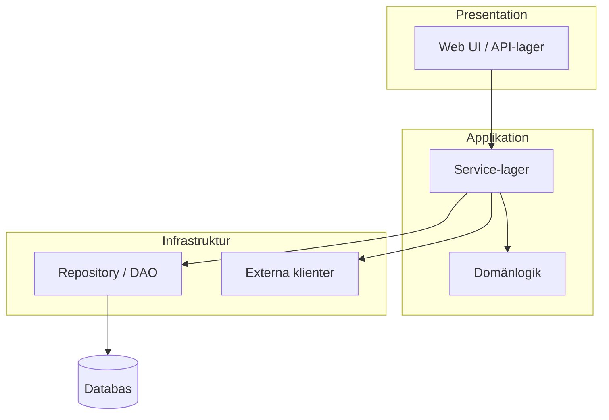
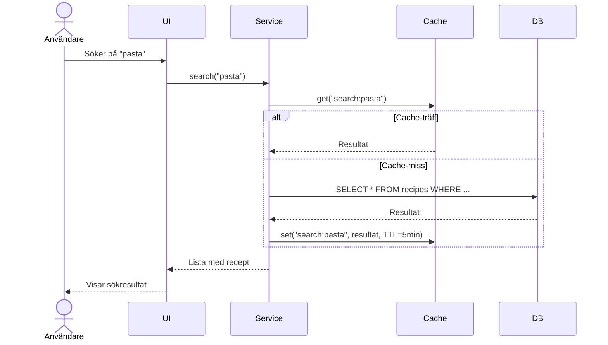

# System Architecture Document (SAD)

## [Produktnamn]

| | |
| --- | --- |
| **Version** | 0.1 |
| **Status** | Utkast / Under granskning / Godkänd |
| **Datum** | ÅÅÅÅ-MM-DD |
| **Författare** | [Namn] |
| **Kopplad till** | Kravdokumentation v[X.X] |

### Versionshistorik

| Version | Datum | Förändring | Författare |
| --- | --- | --- | --- |
| 0.1 | ÅÅÅÅ-MM-DD | Initial version | [Namn] |

---

## 1. Arkitekturöversikt

> *½–1 sida som sammanfattar systemets övergripande design. Ska kunna läsas fristående.*

**Arkitekturmönster:**  
[Beskriv valt mönster, t.ex. Layered Architecture, Hexagonal Architecture, Event-Driven, Microservices, Monolith]

**Primära teknologier:**  
[Kort lista med de viktigaste teknologivalen och ett ord om varför]

**Viktigaste kvalitetsattribut (prioritetsordning):**  

1. [t.ex. Underhållbarhet – liten kodbas, viktigt att kunna ändra snabbt]
2. [t.ex. Korrekthet – finansiell data får inte vara felaktig]
3. [t.ex. Prestanda]

**Arkitekturella begränsningar:**  
[Krav eller beslut som begränsar arkitekturvalen, t.ex. "måste köra on-premise", "befintligt databassystem"]

---

## 2. Kontextvy

> Visar systemet som en svart låda och dess relationer till externa aktörer och system.  
> Rita med Mermaid, draw.io eller liknande. Ersätt kodblocket nedan med ditt diagram.

**Beskrivning av externa relationer:**

| Aktör / System | Relation | Protokoll/Format | Riktning |
| --- | --- | --- | --- |
| [Slutanvändare] | Primär användare av systemet | HTTPS / Browser | → System |
| [Extern API] | [Beskriv syftet] | REST / JSON | System → |
| [Databas] | Primär datapersistens | SQL / JDBC | System → |

---

## 3. Komponentvy

> Visar systemets interna struktur – moduler, lager, tjänster och deras beroenden.

**Komponentbeskrivningar:**

| Komponent | Ansvar | Teknologi |
| --- | --- | --- |
| [Web UI / API-lager] | Tar emot HTTP-requests, validerar input, returnerar svar | [t.ex. Spring MVC / React] |
| [Service-lager] | Orkestrerar affärsflöden, transaktionshantering | [t.ex. Spring Service] |
| [Domänlogik] | Kärn-affärsregler, domänobjekt | [t.ex. Java POJO / Domain model] |
| [Repository / DAO] | Abstraktion mot databas, CRUD-operationer | [t.ex. Spring Data JPA] |
| [Externa klienter] | Integration mot externa API:er | [t.ex. Feign / RestTemplate] |

---

## 4. Dataflödesvy

> Beskriv hur data flödar för de 2–3 viktigaste use cases. Fokusera på kärn-scenarierna.

### Dataflöde: [Flödesnamn – t.ex. "Användare söker recept"]

---

## 5. Teknologival

> Dokumentera vad som valdes, varför, och vad som övervägdes men valdes bort.

| Komponent | Vald teknologi | Motivering | Övervägda alternativ |
| --- | --- | --- | --- |
| Backend-ramverk | [t.ex. Spring Boot] | [Teamkompetens, ekosystem, DI] | [t.ex. Micronaut, Quarkus] |
| Frontend | [t.ex. React + Tailwind] | [Komponentbaserat, snabb styling] | [t.ex. Vue, vanilla HTML] |
| Databas | [t.ex. PostgreSQL] | [Relationell data, ACID, open source] | [t.ex. MySQL, MongoDB] |
| Autentisering | [t.ex. JWT + OAuth2] | [Stateless, standardiserat] | [t.ex. Session-baserat] |
| Build / Deploy | [t.ex. Maven + Docker] | [Reproducerbar build, portabilitet] | [t.ex. Gradle, bare metal] |
| CI/CD | [t.ex. GitHub Actions] | [Integrerat i repo, gratis för OSS] | [t.ex. Jenkins, GitLab CI] |

---

## 6. Arkitekturella beslut (ADR)

> Varje betydande arkitekturellt beslut dokumenteras som ett ADR.  
> Markera föråldrade ADR:er med `Status: Föråldrad` – ta aldrig bort dem.

---

### ADR-001 · [Beslutets titel]

| Fält | Värde |
| --- | --- |
| **Status** | Föreslagen / Under granskning / Godkänd / Föråldrad |
| **Datum** | ÅÅÅÅ-MM-DD |
| **Beslutsfattare** | [Namn] |

**Kontext:**  
[Beskriv situationen och problemet som föranledde beslutet. Vad är det som behövde bestämmas?]

**Beslut:**  
[Beskriv det beslut som fattades, konkret och utan tvetydighet.]

**Motivering:**  
[Varför fattades detta beslut? Vilka faktorer vägde tyngst?]

**Konsekvenser:**

| + Fördelar | - Nackdelar |
| --- | --- |
| [Fördel 1] | [Nackdel 1] |
| [Fördel 2] | [Nackdel 2] |

**Övervägda alternativ:**

- **[Alternativ A]:** [Varför det valdes bort]
- **[Alternativ B]:** [Varför det valdes bort]

---

### ADR-002 · [Nästa besluts titel]

| Fält | Värde |
| --- | --- |
| **Status** | Godkänd |
| **Datum** | ÅÅÅÅ-MM-DD |
| **Beslutsfattare** | [Namn] |

**Kontext:**  
[...]

**Beslut:**  
[...]

**Konsekvenser:**

| + Fördelar | - Nackdelar |
| --- | --- |
| | |

---

## 7. Kvalitetsattribut och arkitekturella taktiker

> Koppla NFR:erna från kravdokumentationen till konkreta arkitekturlösningar.

| NFR-ID | Krav | Arkitekturlösning / Taktik |
| --- | --- | --- |
| NFR-P01 | Svarstid < [X] ms | [t.ex. Caching med Redis, databas-indexering] |
| NFR-A01 | Uptime [X]% | [t.ex. Hälsokontroll-endpoint, automatisk omstart] |
| NFR-M01 | Testbar affärslogik | [t.ex. Hexagonal architecture, dependency injection] |
| NFR-SEC01 | TLS 1.2+ | [t.ex. Reverse proxy hanterar TLS-terminering] |

---

## 8. Teknisk skuld och kända brister

> Dokumentera medvetna kompromisser som gjorts. Teknisk skuld som är synlig är hanterbar.

| ID | Beskrivning | Orsak | Planerad åtgärd |
| --- | --- | --- | --- |
| TD-001 | [Kompromiss eller brist] | [Varför gjordes kompromissen?] | [Sprints/version när det åtgärdas] |

---

*Nästa steg: Specificera Datamodell & API-kontrakt baserat på komponentvyn och dataflödena i detta dokument.*
