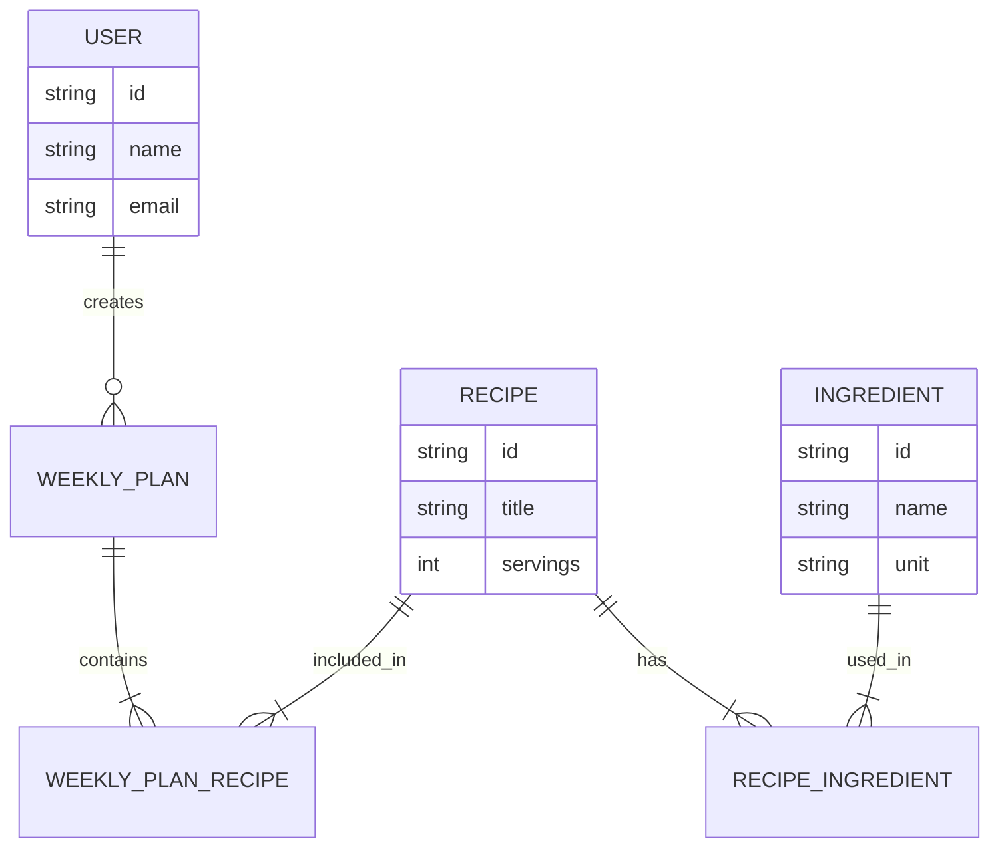

# Data Model & API Contract

## [Product name]

| | |
| --- | --- |
| **Version** | 0.1 |
| **Status** | Draft / Under review / Approved |
| **Date** | YYYY-MM-DD |
| **Author** | [Name] |
| **Related to** | SAD v[X.X] |

### Version history

| Version | Date | Change | Author |
| --- | --- | --- | --- |
| 0.1 | YYYY-MM-DD | Initial version | [Name] |

---

## 1. Domain model

> Shows the domain entities and their relationships in a way that is understandable without
> database-specific details. The model should be understandable to a non-technical reader.



**Relationships in plain language:**

- A **User** can have many **Weekly Plans**.
- A **Weekly Plan** contains one or more **Recipes** through a join entity.
- A **Recipe** can be included in many **Weekly Plans**.
- A **Recipe** consists of one or more **Ingredients**, each with an amount and unit.

### Domain entities

| Entity | Purpose | Identity | Relationships | Lifecycle |
| --- | --- | --- | --- | --- |
| [Entity] | [Business purpose] | [Stable identifier] | [Related entities] | [Creation and deletion rules] |

Document invariants here, before they are translated into database constraints or API validation.

---

## 2. Physical data model

> Describes the actual database schema. Maintain the schema primarily as migration scripts
> (Flyway, Liquibase, or an equivalent tool). A schema diagram should be generated from the
> actual database and updated whenever the schema changes.

### Migration strategy

**Tool:** [Flyway / Liquibase / Manual SQL scripts]
**Naming convention:** `V[version]__[description].sql`, for example `V1__initial_schema.sql`
**Repository location:** `/src/main/resources/db/migration/`
**Rollback policy:** [Describe whether down migrations, forward fixes, or backups are used.]
**Destructive changes:** [Describe approval, backup, and deployment requirements.]

### Tables

#### `users`

| Column | Type | Nullable | Default | Description |
| --- | --- | --- | --- | --- |
| `id` | UUID | NOT NULL | `gen_random_uuid()` | Primary key |
| `email` | VARCHAR(255) | NOT NULL | — | Unique email address |
| `display_name` | VARCHAR(100) | NOT NULL | — | Display name |
| `created_at` | TIMESTAMP | NOT NULL | `NOW()` | Creation timestamp |
| `updated_at` | TIMESTAMP | NOT NULL | `NOW()` | Last update timestamp |

*Index:* `UNIQUE (email)`

#### `recipes`

| Column | Type | Nullable | Default | Description |
| --- | --- | --- | --- | --- |
| `id` | UUID | NOT NULL | `gen_random_uuid()` | Primary key |
| `user_id` | UUID | NOT NULL | — | Foreign key to `users.id` |
| `title` | VARCHAR(200) | NOT NULL | — | Recipe title |
| `servings` | INT | NOT NULL | `4` | Base number of servings |
| `created_at` | TIMESTAMP | NOT NULL | `NOW()` | Creation timestamp |

*Foreign key:* `user_id → users(id) ON DELETE CASCADE`
*Indexes:* `(user_id)`, `(title)`

#### `[Next table]`

| Column | Type | Nullable | Default | Description |
| --- | --- | --- | --- | --- |
| | | | | |

### Data lifecycle and integrity

Document ownership, cascade behavior, soft deletion, archival, retention, uniqueness, indexing,
concurrency, and audit requirements. Make explicit which rules are enforced by the database and
which are enforced by the application.

---

## 3. API contract

> Document every externally visible endpoint here. The OpenAPI or equivalent machine-readable
> specification is generated from, validated against, or otherwise kept contractually aligned with
> this document.

**Canonical contract:** `[path/to/openapi.yaml]`
**Base URL:** `https://[host]/api/v1`
**Authentication:** Bearer token in the `Authorization` header, unless stated otherwise
**Versioning strategy:** [URL path / header / content negotiation]

### 3.1 Authentication

#### `POST /auth/login`

Authenticates a user and returns an access token.

**Authentication:** Not required

**Request body:**

```json
{
  "email": "user@example.com",
  "password": "example-password"
}
```

| Field | Type | Required | Description |
| --- | --- | --- | --- |
| `email` | string | Yes | User email address |
| `password` | string | Yes | Password sent over TLS |

**Responses:**

`200 OK`

```json
{
  "accessToken": "example-token",
  "expiresIn": 3600
}
```

`401 Unauthorized`

```json
{
  "error": "INVALID_CREDENTIALS",
  "message": "Email address or password is incorrect"
}
```

`422 Unprocessable Entity` – Validation error

```json
{
  "error": "VALIDATION_ERROR",
  "fields": {
    "email": "Invalid email address"
  }
}
```

### 3.2 Recipes

#### `GET /recipes`

Returns a paginated list of recipes available to the authenticated user.

**Query parameters:**

| Parameter | Type | Default | Description |
| --- | --- | --- | --- |
| `page` | int | 0 | Zero-based page number |
| `size` | int | 20 | Items per page, maximum 100 |
| `search` | string | — | Free-text search by title |

**Response `200 OK`:**

```json
{
  "content": [
    {
      "id": "550e8400-e29b-41d4-a716-446655440000",
      "title": "Pasta Carbonara",
      "servings": 4,
      "createdAt": "2025-01-15T10:30:00Z"
    }
  ],
  "page": 0,
  "size": 20,
  "totalElements": 42,
  "totalPages": 3
}
```

#### `GET /recipes/{id}`

Returns one recipe and its ingredients.

| Path parameter | Type | Description |
| --- | --- | --- |
| `id` | UUID | Recipe identifier |

`200 OK` – Returns the recipe with its complete ingredient list.
`404 Not Found` – The recipe does not exist or belongs to another user.

#### `POST /recipes`

Creates a new recipe.

```json
{
  "title": "Pasta Carbonara",
  "servings": 4,
  "ingredients": [
    {
      "name": "Spaghetti",
      "amount": 400,
      "unit": "g"
    }
  ]
}
```

`201 Created` – Returns the created recipe with its generated identifier.
`422 Unprocessable Entity` – The request body fails validation.

#### `PUT /recipes/{id}`

Replaces a recipe in full.

`200 OK` – Returns the updated recipe.
`404 Not Found` – The recipe does not exist or is not accessible.
`422 Unprocessable Entity` – The replacement fails validation.

#### `DELETE /recipes/{id}`

Deletes a recipe according to the lifecycle policy defined in the physical data model.

`204 No Content` – Deletion succeeded.
`404 Not Found` – The recipe does not exist or is not accessible.

### 3.3 [Next resource]

#### `[METHOD] /[resource]`

[Repeat the endpoint structure above. Document purpose, authorization, parameters, request body,
success response, error responses, idempotency, and side effects.]

---

## 4. Error code registry

> Standardized error codes returned in the `error` field. Keep the error shape stable and avoid
> exposing implementation details or sensitive information.

| Error code | HTTP status | Description |
| --- | --- | --- |
| `INVALID_CREDENTIALS` | 401 | Login credentials are incorrect |
| `TOKEN_EXPIRED` | 401 | Access token has expired |
| `FORBIDDEN` | 403 | Caller lacks permission for the resource |
| `NOT_FOUND` | 404 | Resource does not exist or is not visible |
| `VALIDATION_ERROR` | 422 | Input does not satisfy validation rules |
| `CONFLICT` | 409 | Resource already exists or conflicts with current state |
| `INTERNAL_ERROR` | 500 | Unexpected server error |

---

## 5. Security, privacy, and compatibility

| Data or interface | Classification | Protection | Retention / lifecycle | Access |
| --- | --- | --- | --- | --- |
| [Data or endpoint] | Public / Internal / Sensitive | [Encryption, masking, validation] | [Policy] | [Roles or scopes] |

Document authorization rules, tenant boundaries, personal-data handling, rate limits, pagination
limits, idempotency, backwards compatibility, and deprecation policy. Never put real credentials,
tokens, or personal data in this document.

---

## 6. Definition of Done

- [ ] Domain invariants and relationships are documented in plain language.
- [ ] The physical model, migrations, indexes, and lifecycle rules are explicit.
- [ ] The canonical API contract is updated before implementation begins.
- [ ] Authentication, authorization, request validation, errors, and compatibility are documented.
- [ ] Privacy, retention, migrations, rollback, and destructive-change handling are explicit.
- [ ] Automated contract or schema validation is part of the test and deployment workflow.

---

*Next step: Define the Deployment View based on the technology choices in the SAD and the API
contract above.*

*Clarity Framework v3.2.2 – Data Model & API Contract*
