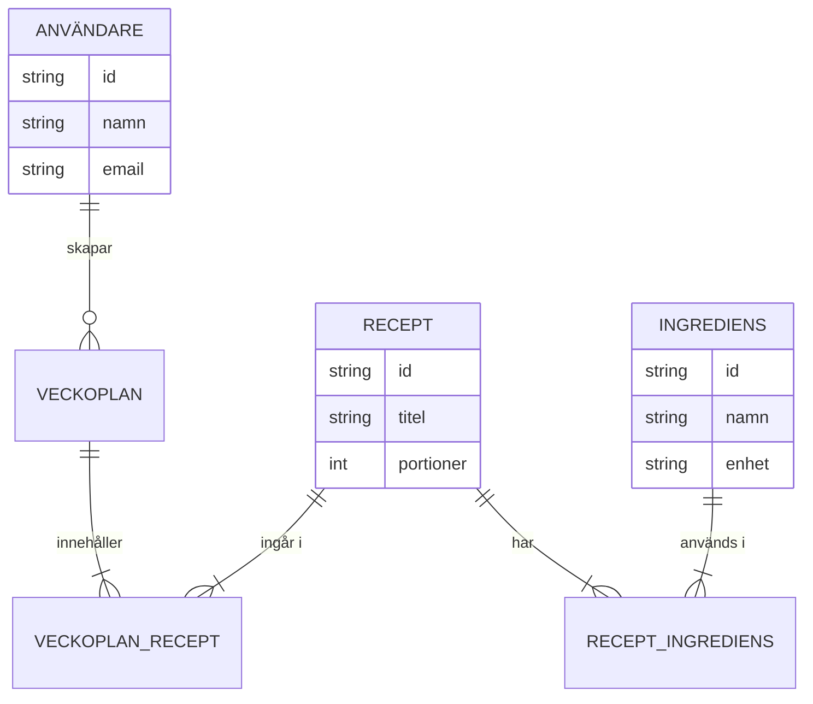

# Datamodell & API-kontrakt

## [Produktnamn]

| | |
| --- | --- |
| **Version** | 0.1 |
| **Status** | Utkast / Godkänd |
| **Datum** | ÅÅÅÅ-MM-DD |
| **Författare** | [Namn] |
| **Kopplad till** | SAD v[X.X] |

### Versionshistorik

| Version | Datum | Förändring | Författare |
| --- | --- | --- | --- |
| 0.1 | ÅÅÅÅ-MM-DD | Initial version | [Namn] |

---

## 1. Domänmodell

> Visar domänens entiteter och relationer på ett begripligt sätt – utan databastekniska detaljer.  
> Ska kunna förstås av en icke-teknisk person.



**Relationer i klartext:**

- En **Användare** kan ha många **Veckoplaner**
- En **Veckoplan** innehåller ett eller flera **Recept** (via en kopplingstabell)
- Ett **Recept** kan ingå i många **Veckoplaner**
- Ett **Recept** består av en eller flera **Ingredienser** (med mängd och enhet)

---

## 2. Fysisk datamodell

> Det faktiska databasschema. Underhålls primärt som migrationsscript (Flyway/Liquibase).  
> Diagrammet ska genereras från faktisk databas – uppdatera vid schemaförändringar.

### Migrationsstrategi

**Verktyg:** [Flyway / Liquibase / Manuella SQL-script]  
**Namnkonvention:** `V[version]__[beskrivning].sql`, t.ex. `V1__initial_schema.sql`  
**Plats i repo:** `/src/main/resources/db/migration/`

### Tabeller

#### `users`

| Kolumn | Typ | Nullable | Default | Beskrivning |
| --- | --- | --- | --- | --- |
| `id` | UUID | NOT NULL | gen_random_uuid() | Primärnyckel |
| `email` | VARCHAR(255) | NOT NULL | — | Unik e-postadress |
| `display_name` | VARCHAR(100) | NOT NULL | — | Visningsnamn |
| `created_at` | TIMESTAMP | NOT NULL | NOW() | Skapandetidpunkt |
| `updated_at` | TIMESTAMP | NOT NULL | NOW() | Senast uppdaterad |

*Index:* `UNIQUE (email)`

---

#### `recipes`

| Kolumn | Typ | Nullable | Default | Beskrivning |
| --- | --- | --- | --- | --- |
| `id` | UUID | NOT NULL | gen_random_uuid() | Primärnyckel |
| `user_id` | UUID | NOT NULL | — | FK → users.id |
| `title` | VARCHAR(200) | NOT NULL | — | Receptets titel |
| `servings` | INT | NOT NULL | 4 | Antal portioner (bas) |
| `created_at` | TIMESTAMP | NOT NULL | NOW() | |

*Foreign keys:* `user_id → users(id) ON DELETE CASCADE`  
*Index:* `(user_id)`, `(title)`

---

#### `[Nästa tabell]`

| Kolumn | Typ | Nullable | Default | Beskrivning |
| --- | --- | --- | --- | --- |
| | | | | |

---

## 3. API-översikt och kontraktsbeslut

> **Kanoniskt API-kontrakt:** `[design/openapi.yaml]` – skrivs eller uppdateras före implementation
> och valideras mot koden i CI. Endpointavsnitten nedan är läshjälp och beslutsförklaring; de ska
> inte duplicera hela specifikationen. Vid avvikelse gäller den versionshanterade OpenAPI-filen.
> **Bas-URL:** `https://[host]/api/v1`  
> **Autentisering:** Bearer token i Authorization-header (om ej annat anges)

Ta bara med kritiska eller representativa flöden nedan. Fälttyper, required/nullability,
statuskoder och fullständiga scheman hör hemma i OpenAPI-filen.

---

### 3.1 Autentisering

#### `POST /auth/login`

Autentiserar en användare och returnerar en åtkomsttoken.

**Autentisering:** Ej krävs

**Request body:**

```json
{
  "email": "user@example.com",
  "password": "hemligt123"
}
```

| Fält | Typ | Obligatorisk | Beskrivning |
| --- | --- | --- | --- |
| `email` | string | Ja | Användarens e-postadress |
| `password` | string | Ja | Lösenord i klartext (skickas över TLS) |

**Responses:**

`200 OK`

```json
{
  "accessToken": "eyJhbGci...",
  "expiresIn": 3600
}
```

`401 Unauthorized`

```json
{
  "error": "INVALID_CREDENTIALS",
  "message": "E-postadress eller lösenord är felaktigt"
}
```

`422 Unprocessable Entity` – Valideringsfel

```json
{
  "error": "VALIDATION_ERROR",
  "fields": {
    "email": "Ogiltig e-postadress"
  }
}
```

---

### 3.2 Recept

#### `GET /recipes`

Hämtar en paginerad lista med recept för inloggad användare.

**Query-parametrar:**

| Parameter | Typ | Default | Beskrivning |
| --- | --- | --- | --- |
| `page` | int | 0 | Sidnummer (0-baserat) |
| `size` | int | 20 | Antal per sida (max 100) |
| `search` | string | — | Fritextsökning på titel |

**Response `200 OK`:**

```json
{
  "content": [
    {
      "id": "550e8400-e29b-41d4-a716-446655440000",
      "title": "Pasta Carbonara",
      "servings": 4,
      "createdAt": "2025-01-15T10:30:00Z"
    }
  ],
  "page": 0,
  "size": 20,
  "totalElements": 42,
  "totalPages": 3
}
```

---

#### `GET /recipes/{id}`

Hämtar ett specifikt recept med ingredienser.

**Path-parametrar:**

| Parameter | Typ | Beskrivning |
| --- | --- | --- |
| `id` | UUID | Receptets unika ID |

**Responses:**

`200 OK` – Returnerar receptet med fullständiga ingredienser  
`404 Not Found` – Recept med angivet ID existerar inte eller tillhör annan användare

---

#### `POST /recipes`

Skapar ett nytt recept.

**Request body:**

```json
{
  "title": "Pasta Carbonara",
  "servings": 4,
  "ingredients": [
    {
      "name": "Spaghetti",
      "amount": 400,
      "unit": "g"
    }
  ]
}
```

**Responses:**

`201 Created` – Returnerar det skapade receptet med genererat ID  
`422 Unprocessable Entity` – Valideringsfel i request body

---

#### `PUT /recipes/{id}`

Ersätter ett recept fullständigt (full update).

**Responses:**

`200 OK` – Returnerar uppdaterat recept  
`404 Not Found`  
`422 Unprocessable Entity`

---

#### `DELETE /recipes/{id}`

Tar bort ett recept permanent.

**Responses:**

`204 No Content` – Lyckad borttagning  
`404 Not Found`

---

### 3.3 [Nästa resurs]

#### `GET /[resurs]`

[Upprepa mönstret ovan]

---

## 4. Felkodregister

> Standardiserade felkoder som returneras i `error`-fältet.

| Felkod | HTTP-status | Beskrivning |
| --- | --- | --- |
| `INVALID_CREDENTIALS` | 401 | Felaktiga inloggningsuppgifter |
| `TOKEN_EXPIRED` | 401 | Åtkomsttoken har gått ut |
| `FORBIDDEN` | 403 | Behörighet saknas för resursen |
| `NOT_FOUND` | 404 | Resursen existerar inte |
| `VALIDATION_ERROR` | 422 | Indata uppfyller inte valideringsregler |
| `CONFLICT` | 409 | Resursen existerar redan (t.ex. duplicate email) |
| `INTERNAL_ERROR` | 500 | Oväntat serverfel |

---

*Nästa steg: Definiera Deployment View baserat på teknologivalen i SAD och API-kontraktet ovan.*
