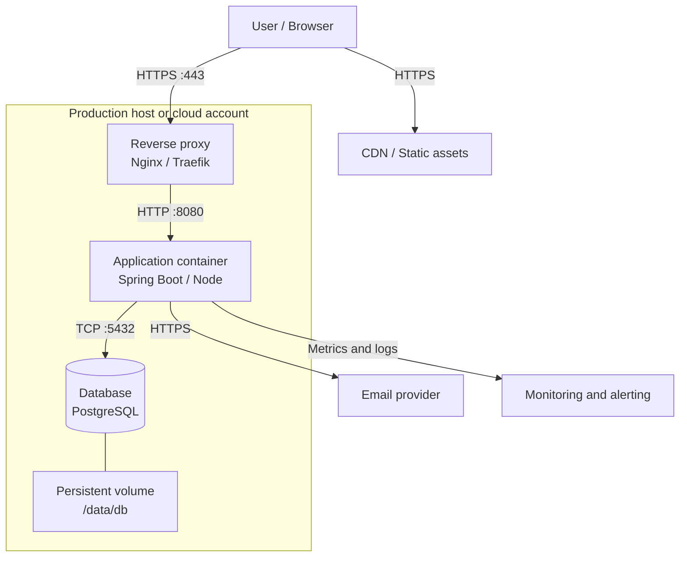

# Deployment View

## [Product name]

| | |
| --- | --- |
| **Version** | 0.1 |
| **Status** | Draft / Under review / Approved |
| **Date** | YYYY-MM-DD |
| **Author** | [Name] |
| **Related to** | SAD v[X.X] |

### Version history

| Version | Date | Change | Author |
| --- | --- | --- | --- |
| 0.1 | YYYY-MM-DD | Initial version | [Name] |

---

## 1. Environment overview

| Environment | Purpose | URL / host | Updated by |
| --- | --- | --- | --- |
| **Local development** | Individual development | `localhost` | Each developer |
| **Staging** | Integration, QA, and demos | `staging.[domain]` | On merge to `main` |
| **Production** | Live operation | `[domain]` | On approved release |

### Configuration differences

| Parameter | Local | Staging | Production |
| --- | --- | --- | --- |
| Log level | DEBUG | INFO | WARN |
| Database | Local container | Staging database | Production database |
| Cache | Disabled or local | Enabled | Enabled |
| Email delivery | Captured in development inbox | Test recipients | Real recipients |
| External integrations | Mocks or sandboxes | Test accounts | Production accounts |
| Backups | Optional | Scheduled | Scheduled and verified |

Document the purpose, data sensitivity, access rules, and reset procedure for every environment.
State whether staging contains production data; production data should not be copied into lower
environments without documented minimization or anonymization.

---

## 2. Infrastructure topology

> Replace this example with the actual infrastructure diagram. Show trust boundaries, public and
> private networks, persistent storage, external services, and the direction of important traffic.



### Component capacity

| Component | Technology | CPU | Memory | Disk | Scaling | Availability |
| --- | --- | --- | --- | --- | --- | --- |
| Reverse proxy | [Nginx / Traefik] | [X] vCPU | [X] GB | [X] GB | [Manual / Auto] | [Target] |
| Application | [Spring Boot / Node] | [X] vCPU | [X] GB | — | [Manual / Auto] | [Target] |
| Database | [PostgreSQL X.X] | [X] vCPU | [X] GB | [X] GB | [Vertical / Managed] | [Target] |
| Persistent storage | [Block / Object storage] | — | — | [X] GB | [Policy] | [Target] |

### Network and trust boundaries

Document which components are public, which are private, required ports, TLS termination, firewall
rules, outbound access, DNS ownership, and the accounts or roles allowed to administer each layer.

---

## 3. Container and service configuration

> The complete production configuration is versioned in the repository, for example under
> `/deploy/docker-compose.prod.yml`, Helm charts, Terraform, or the platform's equivalent.

```yaml
services:
  proxy:
    image: traefik:v3.0
    restart: unless-stopped
    ports:
      - "80:80"
      - "443:443"
    volumes:
      - /var/run/docker.sock:/var/run/docker.sock:ro
      - ./traefik:/etc/traefik

  app:
    image: [registry]/[product-name]:${APP_VERSION}
    restart: unless-stopped
    environment:
      - APP_ENV=production
      - DB_URL=${DB_URL}
      - DB_PASSWORD=${DB_PASSWORD}
    depends_on:
      db:
        condition: service_healthy

  db:
    image: postgres:16-alpine
    restart: unless-stopped
    volumes:
      - db_data:/var/lib/postgresql/data
    healthcheck:
      test: ["CMD-SHELL", "pg_isready -U ${DB_USER}"]
      interval: 10s
      timeout: 5s
      retries: 5

volumes:
  db_data:
    driver: local
```

For every service, document the image or artifact source, version pinning, ports, volumes, health
checks, resource limits, restart policy, dependencies, and whether the service is stateful.

---

## 4. Configuration and secrets

**Rule:** Never commit plaintext secrets to Git. Sensitive values must be supplied through
environment variables, a secret manager, or the hosting platform's protected configuration.

| Variable | Description | Environment | Sensitive | Source |
| --- | --- | --- | --- | --- |
| `APP_VERSION` | Container image tag or artifact version | All | No | Release tag |
| `DB_URL` | Database connection string | All | No / partial | Environment configuration |
| `DB_PASSWORD` | Database password | All | Yes | Secret manager |
| `JWT_SECRET` | JWT signing key | All | Yes | Secret manager |
| `SMTP_PASSWORD` | Email provider password | Staging, Production | Yes | Secret manager |

### Secret handling

- Local development: `.env` file excluded by `.gitignore`, or a local secret store.
- Staging and production: [GitHub Actions secrets, cloud secret manager, Vault, or equivalent].
- Rotation: [Describe schedule, owner, procedure, and impact on running services].
- Emergency revocation: [Describe who can revoke credentials and how the service is restarted].

### Naming convention

```text
[COMPONENT]_[PROPERTY]
DB_URL, DB_PASSWORD, SMTP_HOST, SMTP_PORT
```

Document configuration defaults, validation at startup, environment-specific overrides, and how a
configuration change is reviewed and audited.

---

## 5. CI/CD pipeline

> Pipeline configuration is versioned under `.github/workflows/` or the equivalent CI/CD system.
> Releases are manually tagged; deployment automation may execute after the approved release
> trigger, but must not create releases or tags implicitly.

### Flow

```text
Push to feature branch
        ↓
    Build and compile
        ↓
    Unit tests
        ↓
    Static analysis and dependency checks
        ↓
    Build artifact or container image
        ↓
Merge to main after required checks
        ↓
    Integration and contract tests
        ↓
    Deploy to staging
        ↓
    Smoke test and visual UX verification where applicable
        ↓
Manual release tag and approval
        ↓
    Deploy to production
        ↓
    Production smoke test and monitoring confirmation
```

### Pipeline stages

| Stage | Trigger | Automatic | Blocking | Evidence |
| --- | --- | --- | --- | --- |
| Build and unit tests | Push to any branch | Yes | Yes | Test report |
| Static analysis | Push to any branch | Yes | [Yes / No] | Analysis report |
| Dependency and security scan | Pull request or scheduled run | Yes | [Yes / No] | Scan report |
| Integration and contract tests | Merge to `main` | Yes | Yes | Test report |
| Staging deployment | Merge to `main` | Yes | — | Deployment record |
| Staging smoke test | After staging deployment | Yes | Yes | Smoke-test evidence |
| Production deployment | Approved release tag | Manual approval | — | Release record |
| Production smoke test | After production deployment | Yes | Alert on failure | Smoke-test evidence |

Document branch protection, required checks, deployment permissions, reviewers, protected
environments, concurrency rules, action versions, artifact retention, and how failed deployments
are prevented from being promoted.

---

## 6. Release traceability

Every production deployment must connect the same version and commit across:

- the manually created Git tag and GitHub Release;
- the published artifact or container image;
- the deployment record and environment;
- migration execution and database state;
- smoke-test and visual verification evidence where applicable;
- the approved rollback target.

Record who approved the release, when it was deployed, which checks passed, and where the release
can be inspected after deployment.

---

## 7. Monitoring, logging, and health

### Structured logging

**Format:** Structured JSON
**Levels:** Local `DEBUG`, staging `INFO`, production `WARN` for application logs and `ERROR` for
infrastructure logs
**Destination:** Local stdout or file; staging and production [Loki, Papertrail, ELK, or equivalent]

Every log entry should include the fields needed to investigate a request without exposing secrets:

```json
{
  "timestamp": "2025-01-15T10:30:00.123Z",
  "level": "INFO",
  "service": "product-name",
  "traceId": "example-trace-id",
  "message": "Request completed",
  "context": {}
}
```

### Health checks

**Endpoint:** `GET /health`
**Authentication:** Not required, but do not expose credentials, connection strings, or internal
topology
**Checks:**

- [ ] Application starts and responds.
- [ ] Database connection is available.
- [ ] Cache and queue dependencies are available where required.
- [ ] Critical external integrations are within the defined policy.

**Expected `200 OK` response:**

```json
{
  "status": "UP",
  "components": {
    "database": { "status": "UP" },
    "cache": { "status": "UP" }
  }
}
```

### Alerts

| Trigger | Channel | Recipient | Priority | First response |
| --- | --- | --- | --- | --- |
| Health endpoint is not `200` | [Email / Slack / PagerDuty] | [Owner] | Critical | [Action] |
| Disk usage above 85% | [Channel] | [Owner] | High | [Action] |
| Memory usage above 90% | [Channel] | [Owner] | High | [Action] |
| 5xx error rate above [X]% | [Channel] | [Owner] | High | [Action] |
| Backup verification fails | [Channel] | [Owner] | Critical | [Action] |

Define retention, dashboard ownership, alert thresholds, maintenance windows, and the escalation
path for every production alert.

---

## 8. Backup, recovery, and rollback

| Asset | Frequency | Retention | Restore test | Owner |
| --- | --- | --- | --- | --- |
| Database | [Schedule] | [Policy] | [Schedule] | [Owner] |
| Object or file storage | [Schedule] | [Policy] | [Schedule] | [Owner] |
| Configuration and secrets | [Schedule] | [Policy] | [Schedule] | [Owner] |

Document the recovery point objective (RPO), recovery time objective (RTO), backup encryption,
restore procedure, and data-loss risks. A backup is not considered reliable until a restore has
been tested and recorded.

### Rollback procedure

```bash
# Identify the last approved version.
git tag --list | sort -V | tail -10

# Deploy the previous version using the approved deployment command.
APP_VERSION=[previous-tag] docker compose -f docker-compose.prod.yml up -d app

# Verify service health.
curl -f https://[domain]/health
```

Before rollback, state whether database migrations are backwards-compatible. After rollback,
verify application health, data integrity, background jobs, user impact, and monitoring. Record the
result in Change Management and open a follow-up action for the cause of the failed release.

---

## 9. Document completeness

- [ ] Environments, topology, capacity, access, and trust boundaries are documented.
- [ ] Container or service configuration, health checks, volumes, and resource limits are versioned.
- [ ] Configuration and secret handling are explicit, with no secrets committed to Git.
- [ ] CI/CD stages, permissions, approvals, evidence, and manual release tagging are documented.
- [ ] Release traceability connects the tag, commit, artifact, deployment, and rollback target.
- [ ] Logging, monitoring, alerts, backups, recovery, and ownership are documented.
- [ ] Deployment is repeatable and rollback has been tested or explicitly rehearsed.
- [ ] Production readiness includes smoke tests and visual UX verification for UI changes.

---

*Next step: Produce Test Documentation and the Runbook in parallel with implementation.*

*Clarity Framework v3.3.0 – Deployment View*
