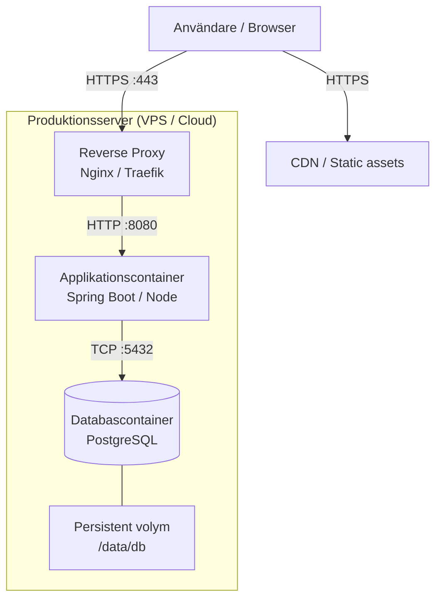

# Driftsättningsvy (Deployment View)

## [Produktnamn]

| | |
| --- | --- |
| **Version** | 0.1 |
| **Status** | Utkast / Godkänd |
| **Datum** | ÅÅÅÅ-MM-DD |
| **Författare** | [Namn] |
| **Kopplad till** | SAD v[X.X] |

### Versionshistorik

| Version | Datum | Förändring | Författare |
| --- | --- | --- | --- |
| 0.1 | ÅÅÅÅ-MM-DD | Initial version | [Namn] |

---

## 1. Miljööversikt

| Miljö | Syfte | URL / Host | Uppdateras |
| --- | --- | --- | --- |
| **Lokal (dev)** | Individuell utveckling | `localhost` | Av varje utvecklare |
| **Staging** | Integration, QA, demo | `staging.[domän]` | Vid merge till `main` |
| **Produktion** | Skarp drift | `[domän]` | Vid godkänd release |

**Konfigurationsskillnader per miljö:**

| Parameter | Lokal | Staging | Produktion |
| --- | --- | --- | --- |
| Loggningsnivå | DEBUG | INFO | WARN |
| Databas | Lokal Docker | Staging DB | Prod DB |
| Cache | Avstängd | Påslagen | Påslagen |
| E-postutskick | Fångad i dev-inbox | Skickas till testadress | Skickas skarpt |

---

## 2. Infrastrukturdiagram

> Ersätt med faktiskt diagram för din infrastruktur.



**Komponentbeskrivning:**

| Komponent | Teknologi | CPU | Minne | Disk |
| --- | --- | --- | --- | --- |
| Reverse proxy | [Nginx / Traefik] | [X] vCPU | [X] GB | [X] GB |
| Applikation | [Spring Boot / Node] | [X] vCPU | [X] GB | — |
| Databas | [PostgreSQL X.X] | [X] vCPU | [X] GB | [X] GB |

---

## 3. Container-konfiguration

### `docker-compose.yml` (produktion)

> Den fullständiga filen versioneras i repot under `/deploy/docker-compose.prod.yml`.  
> Nedan visas struktur och viktiga inställningar.

```yaml
version: "3.9"

services:
  proxy:
    image: traefik:v3.0
    restart: unless-stopped
    ports:
      - "80:80"
      - "443:443"
    volumes:
      - /var/run/docker.sock:/var/run/docker.sock:ro
      - ./traefik:/etc/traefik

  app:
    image: [registry]/[produktnamn]:${APP_VERSION}
    restart: unless-stopped
    environment:
      - SPRING_PROFILES_ACTIVE=prod
      - DB_URL=${DB_URL}
      - DB_PASSWORD=${DB_PASSWORD}
    depends_on:
      db:
        condition: service_healthy
    labels:
      - "traefik.enable=true"
      - "traefik.http.routers.app.rule=Host(`[domän]`)"

  db:
    image: postgres:16-alpine
    restart: unless-stopped
    environment:
      - POSTGRES_DB=${DB_NAME}
      - POSTGRES_USER=${DB_USER}
      - POSTGRES_PASSWORD=${DB_PASSWORD}
    volumes:
      - db_data:/var/lib/postgresql/data
    healthcheck:
      test: ["CMD-SHELL", "pg_isready -U ${DB_USER}"]
      interval: 10s
      timeout: 5s
      retries: 5

volumes:
  db_data:
    driver: local
```

---

## 4. Konfigurationshantering

### Environment-variabler

**Regel:** Inga plaintext-hemligheter i Git. Alla känsliga värden via environment-variabler eller secrets manager.

| Variabel | Beskrivning | Miljö | Känslig |
| --- | --- | --- | --- |
| `APP_VERSION` | Docker image-tagg | Alla | Nej |
| `DB_URL` | JDBC-connection string | Alla | Nej |
| `DB_PASSWORD` | Databaslösenord | Alla | **Ja** |
| `JWT_SECRET` | Signeringsnyckel för JWT | Alla | **Ja** |
| `SMTP_PASSWORD` | E-postlösenord | Staging, Prod | **Ja** |

**Hantering av känsliga värden:**

- Lokalt: `.env`-fil (finns i `.gitignore`)
- Staging/Prod: [Beskriv hur hemligheter hanteras – t.ex. GitHub Secrets, HashiCorp Vault, server .env]

### Namnkonvention

```text
[KOMPONENT]_[EGENSKAP]
DB_URL, DB_PASSWORD, SMTP_HOST, SMTP_PORT
```

---

## 5. CI/CD-pipeline

> Pipeline-konfigurationen versioneras i repot under `.github/workflows/` eller motsvarande.

### Repository- och mergeflöde

| Regel | Projektets val |
| --- | --- |
| Primär branch | `main` |
| Branchstrategi | [Kortlivade feature-branches / trunk-based / dokumenterat soloflöde] |
| Branchnamn | `[feature|fix|chore]/[kort-beskrivning]` |
| Commitformat | [Imperativ beskrivning, eventuell issue-referens] |
| Direkt push till `main` | [Nej / dokumenterat undantag] |
| Mergekrav | [Godkänd review, CI grön, branch uppdaterad] |
| Merge-metod | [Squash / merge commit / rebase] |

**Grundregler:**

- En commit ska vara en sammanhängande och fungerande förändringsenhet
- Pusha en branch och öppna en pull request när ändringen är redo för CI och granskning
- Berörda tester och dokument uppdateras i samma pull request som implementationen
- Hemligheter, lokala `.env`-filer och ej avsedda byggartefakter får aldrig committas

### GitHub Actions-workflows

| Workflow | Fil | Trigger | Syfte | Kräver godkännande |
| --- | --- | --- | --- | --- |
| CI | `.github/workflows/ci.yml` | `pull_request`, push till `main` | Bygg, test och statisk analys | Nej |
| Release | `.github/workflows/release.yml` | Tagg `v*` / `workflow_dispatch` | Verifiera och publicera byggd artefakt | [Ja / Nej] |
| Deploy staging | `.github/workflows/deploy-staging.yml` | Push till `main` | Deploy och smoke test | Nej |
| Deploy produktion | `.github/workflows/deploy-production.yml` | Publicerad release / manuellt | Produktionsdeploy och smoke test | Ja |

**Workflow-skydd:**

- Ange minsta nödvändiga `permissions`; skrivbehörighet aktiveras endast för jobb som publicerar
- Lagra känsliga värden i GitHub Secrets eller extern secrets manager
- Använd GitHub Environments för staging och produktion, inklusive reviewers och miljöspecifika secrets
- Sätt `concurrency` för deployments så att två produktionsdeployments inte körs samtidigt
- Dokumentera tredjeparts-actions och hur deras versioner uppdateras

### Flöde

```text
Push till feature-branch
        ↓
    Bygg (compile)
        ↓
    Enhetstester
        ↓
    Statisk kodanalys (t.ex. SonarQube / Checkstyle)
        ↓
    Docker image byggs
        ↓
Merge till main (automatisk)
        ↓
    Integrationstester
        ↓
    Deploy till staging
        ↓
    Smoke test
        ↓
Tagg / manuellt godkännande (vid release)
        ↓
    Deploy till produktion
        ↓
    Smoke test produktion
```

### Stegbeskrivning

| Steg | Trigger | Automatisk | Blockerar? |
| --- | --- | --- | --- |
| Bygg + enhetstester | Push till alla branches | Ja | Ja – blockar merge |
| Statisk kodanalys | Push till alla branches | Ja | Nej (varning) |
| Deploy staging | Merge till `main` | Ja | — |
| Smoke test staging | Efter staging-deploy | Ja | Ja |
| Deploy produktion | Manuellt / Git-tagg | Manuell trigger | — |
| Smoke test produktion | Efter prod-deploy | Ja | Utlöser alert vid fel |

### Release och GitHub Release

| Egenskap | Projektets val |
| --- | --- |
| Versionsstrategi | [Semantic Versioning / annan dokumenterad strategi] |
| Release-trigger | [Annoterad tagg `vX.Y.Z` / manuellt workflow] |
| Källa för releasenoter | [`CHANGELOG.md` / PR-etiketter / manuellt kuraterade noter] |
| Artefakter | [Container-image, binär, paket, checksummor, SBOM] |
| Ansvarig | [Roll eller namn] |

Varje produktionsrelease ska kunna spåras till samma version och commit i:

- Git-tagg
- GitHub Release
- Publicerade artefakter eller container-image
- Produktionsdeployment

GitHub-releasen ska minst innehålla:

- Sammanfattning av användar- och driftpåverkande ändringar
- Breaking changes och eventuella migreringssteg
- Kända problem eller begränsningar
- Länk till fullständig changelog och jämförelse mot föregående version
- Publicerade artefakter och relevanta verifieringsuppgifter
- Deploymentstatus eller länk till deploymentkörningen

### Rollback-procedur

```bash
# Identifiera tidigare fungerande version
git tag --list | sort -V | tail -10

# Deploya föregående version
APP_VERSION=[föregående-tagg] docker compose -f docker-compose.prod.yml up -d app

# Verifiera
curl -f https://[domän]/health
```

---

## 6. Övervaknings- och loggningsstrategi

### Loggning

**Format:** Strukturerad JSON  
**Nivåer per miljö:**

- Lokal: `DEBUG`
- Staging: `INFO`
- Produktion: `WARN` (applikationsloggar), `ERROR` (infrastrukturloggar)

**Destination:**

- Lokalt: stdout / fil
- Staging/Prod: [t.ex. stdout → Loki / Papertrail / ELK]

**Obligatoriska fält i varje loggpost:**

```json
{
  "timestamp": "2025-01-15T10:30:00.123Z",
  "level": "INFO",
  "service": "produktnamn",
  "traceId": "abc123",
  "message": "...",
  "context": {}
}
```

### Hälsokontroll

**Endpoint:** `GET /health`  
**Autentisering:** Ej krävs  
**Vad kontrolleras:**

- [ ] Applikationen startar och svarar
- [ ] Databasanslutning aktiv
- [ ] [Andra kritiska beroenden]

**Förväntad response `200 OK`:**

```json
{
  "status": "UP"
}
```

Den publika endpointen visar bara sammanvägd status. Detaljer per databas, cache eller annat
beroende exponeras separat bakom autentisering och/eller nätverksbegränsning, till exempel på
`GET /internal/health`, och får inte innehålla anslutningssträngar, credentials eller intern
infrastrukturinformation.

### Alerting

| Trigger | Kanal | Mottagare | Prioritet |
| --- | --- | --- | --- |
| `/health` returnerar ej 200 | [E-post / Slack / PagerDuty] | [Namn] | Kritisk |
| Disk > 85% | [Kanal] | [Namn] | Hög |
| Minne > 90% | [Kanal] | [Namn] | Hög |
| 5xx-felfrekvens > [X]% | [Kanal] | [Namn] | Hög |

---

*Nästa steg: Producera Testdokumentation och Runbook parallellt med implementation.*
